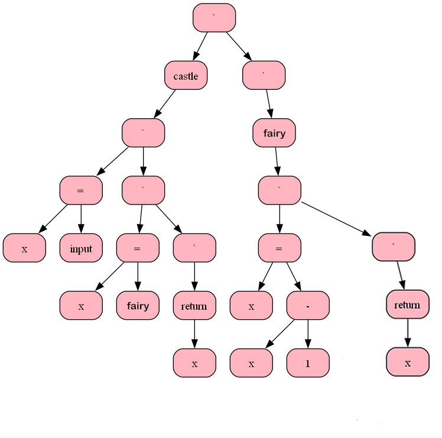
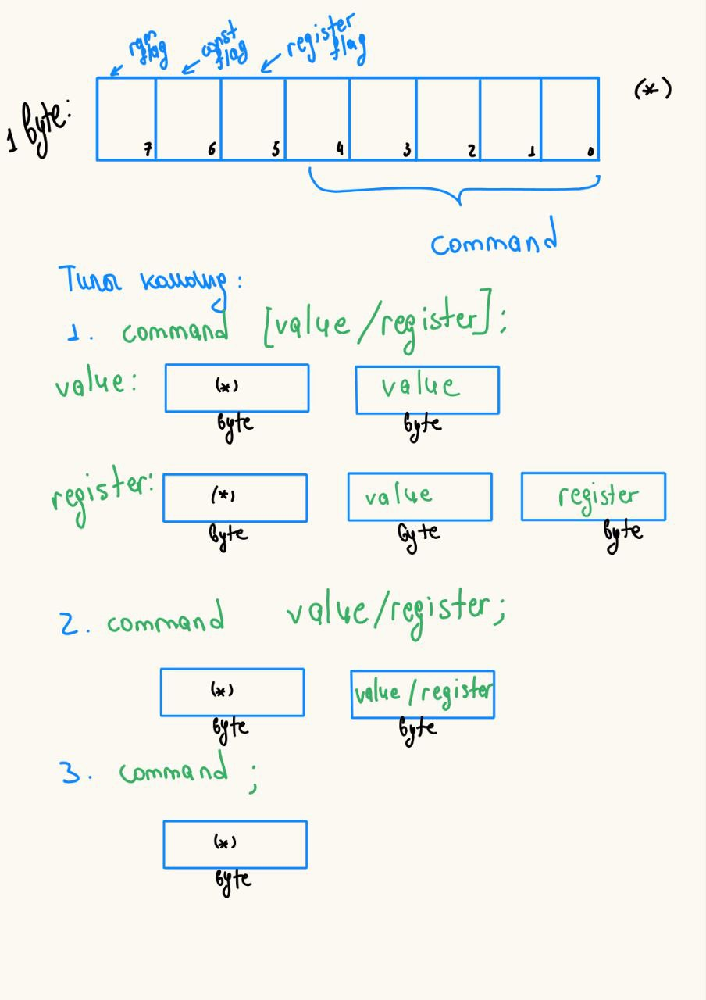

# Женский язык
Этот проект является финальным заданием дополнительно курса Айлаб ( на 1 курсе МФТИ ). 
## Структура
Проект состоит из 5 частей : 
1. fornt-часть, включающая в себя деление на токены, реализацию алгоритма "Рекурсивный спуск", посмотроение бинарного дерева и его графический вывод при помощи Graphviz;
2. middle-часть, реализующая некоторые оптимизации
3. back-часть, создающая файл с моими ассемблерными командами.
4. assembler-часть, которая считывает файл с ассемблерными командами и динамически их кодирует.
5. processor-часть, обрабатывающая файл с закодированными командами и выполняющая их.

## Как установить 
```sh
git clone https://github.com/SashaOiya/Female-language
cd Female-language
```
## Грамматика языка
```sh
Var_Def := ident '=' Get_Comparison ';'
Func_Def := [ ident '(' ')' Statement_List ]* 
Statement_List := '{' [statement]* '}'
statement := Var_Def | If | Retutn | While | Else | Get_Func ( ident '(' ')' ';' ) | ';' // comparison
While := 'while' '(' Get_Comparison ')' Statement_List
Return := 'return' '(' Get_Exp ')' ';'
If := 'if' '(' Get_Comparison ')' Statement_List
Else := 'else' '(' Get_Comparison ')' Statement_List
Get_Comparison := Get_Exp  [ [ '>', '<', '==' ] Get_exp ]*
Get_Exp := Get_Term [ [ '*', '/' ] Get_Term*
Get_Term := Get_Partititon [ [ '+', '-' ] Get_Partition ]*
Get_Partition := '(' Get_Exp ')' | Get_Neg_Number | ident [ Var,Func '(' ')' ]
Get_Power := Get_Part ['^' Get_Part]*
```

## Синтаксис языка

У меня С-подобный язык, поэтому синтакические правила остались практически без изменений, кроме :
```sh
while -> one minute
return -> leave me alone
if -> i take no offence
else -> i am offended
main() -> castle()
input -> give me money
output -> go to the shop
```

У меня нет локальных перемнных, поэтому, введя переменную в любом месте кода, она запоминается до конца программы. 

## Пример программы

```sh
castle ( ) {
	x = give me money();
	x = fairy ();
	go to the shop(x);
	
	leave me alone (x);
}

fairy ()
{
	x = x - 1;
	leave me alone (x);
}
```

Синтаксическое дерево:




## Ассемблер примера

```sh
: 0;	\\castle
in;
pop [1];
call 2;
pop [1];
push [1];
hlt;

: 2;	\\fairy
push 1;
push [1];
sub;
pop [1];
push [1];
ret;
```

## Кодировка

